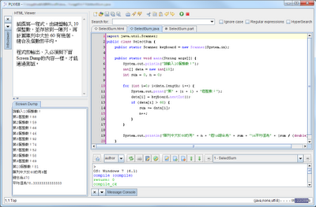



PLWeb 是 Web-based 程式設計學習環境，提供大量 Java、C/C++、Scheme 練習題，強調 Learning by doing 的實作教學。

立即前往：[plweb.org](http://plweb.org/)

一個支援循序漸進、大量練習、上機評量的程式語言教學網站

感恩！本系統論文成果「Java程式設計教學平台」， 榮獲「第十七屆物件導向技術及應用研討會」之「最佳論文獎」。 也感謝以下媒體的報導：

* 中央社與Yahoo奇摩新聞
* 中國時報
* TwoWin教育網
* 中天新聞
* 蕃薯藤News
* 中華日報
* 大紀元新聞
* 雲科大新聞稿

程式設計能力的培養是經由閱讀範例程式， 然後透過修改、模仿及創新的練習逐漸累積而來的。 PLWeb是一個幫助師生能有效的使用這種「動手實做」的學習方法而開發出來的學習平台。 教師可以使用PLWeb設計一系列的程式設計練習， 而學生也可以下載包含這些程式設計練習的編輯器， 方便的完成程式的撰寫、提問、測試及繳交等支援學習的程序。 一個PLWeb的課程包含數個教學單元， 每個單元均由數個在難度上逐漸遞增的程式設計練習所組成。 在完成這些練習題之後，學生便滿足了學習該單元的學習目標。

